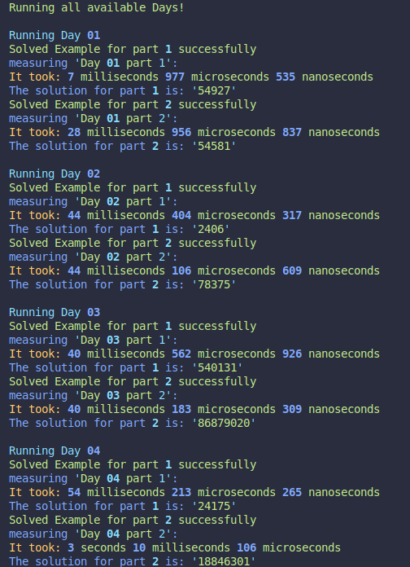

[](https://visitorbadge.io/status?path=https%3A%2F%2Fgithub.com%2FTotto16%2FAOC-2023)

# AoC 2023
Welcome to my Advent of Code 2023 repository! The solutions are written in C++23 using Meson as build system. The solutions aren't optimized for speed, more for readability.

## Running the solutions
For running the code you need [meson](https://mesonbuild.com/Quick-guide.html#installation-using-python) and a C++23 std compatible compiler (e.g. GCC)

Then you can use meson to compile and than execute the solutions


```bash
meson setup build
meson compile -C build
./build/aoc 01 -- or 02 etc.
```
## Features

- base class, that gets the input from file and handles other stuff
- easy input and / or Example handling
- global register map for easy registering of days, than you can execute all registered days
- cli options for measuring time, executing certain days
- colorful output
- exact measurements down to nanoseconds via std::chrono

## Preview




<!--- advent_readme_stars table --->
## 2023 Results

| Day | Part 1 | Part 2 |
| :---: | :---: | :---: |
| [Day 1](https://adventofcode.com/2023/day/1) | ⭐ | ⭐ |
| [Day 2](https://adventofcode.com/2023/day/2) | ⭐ | ⭐ |
| [Day 3](https://adventofcode.com/2023/day/3) | ⭐ | ⭐ |
| [Day 4](https://adventofcode.com/2023/day/4) | ⭐ | ⭐ |
| [Day 5](https://adventofcode.com/2023/day/5) | ⭐ | ⭐ |
| [Day 6](https://adventofcode.com/2023/day/6) | ⭐ | ⭐ |
| [Day 7](https://adventofcode.com/2023/day/7) | ⭐ | ⭐ |
| [Day 8](https://adventofcode.com/2023/day/8) | ⭐ | ⭐ |
| [Day 9](https://adventofcode.com/2023/day/9) | ⭐ | ⭐ |
<!--- advent_readme_stars table --->
